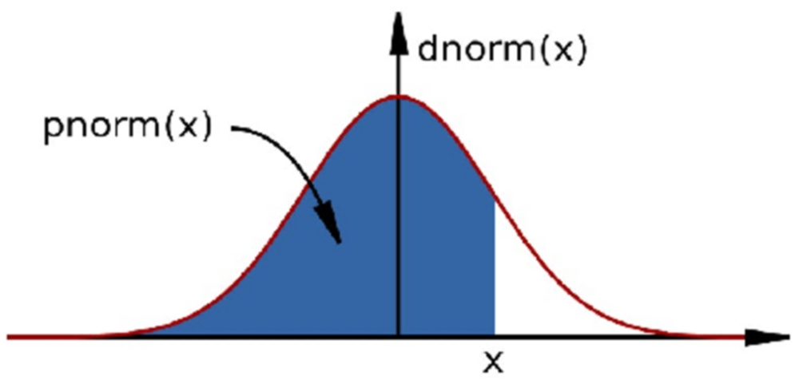

```{r setup, include=FALSE}
#knitr::opts_chunk$set(echo = TRUE)

# knitr::opts_chunk$set(cache = TRUE, warning = FALSE, echo=T,
#                       message = FALSE, cache.lazy = FALSE)

```


# Overview

  - What is reproducible research and why it matters
  - Installing RMarkdown
  - Creating reproducible documents in R
  - Controlling Output Format
  
```{r,echo=F,eval=F}
setwd("/Volumes/bioinfomatics$/Marian/CBW_2022/GitHub/LMS_Reproducible-R/CBW_2022")
```
 
# Reproducible Research in R

Sometime in the future, I, or my successor, will need to understand what analysis I did here.

Using RStudio to make reproducible documents is very easy, so why not?

R Markdown allows one to create reproducible documents, containing your analysis code, results and analysis description in a single neat report

# Creating Notebooks from R Scripts


- Find your R script of interest.
- Add the sessionInfo() function to the last line.
- Click File -> Compile Report -> the "Compile Notebook function" -> Select HTML document as output format (**Ctrl / Cmd + Shift + K**).


# Creating documents from R scripts

## From Scripts to Notes

So, we have just seen the speed at which you can produce a report document from an R script using Rstudio.

Rstudio makes things easy but for fine control we need to look at what is going on within Rstudio.

Rstudio makes use of **rmarkdown** and **knitr** packages.


Several packages offer methods to create notes from R scripts.

One of the simplest way to create a note in R is to use the **render()** function in **rmarkdown** package.

```{r,eval=F}
library(rmarkdown)
render("scripts/script.r")
```

Output from render()

By default the render() function will have created a html file in the current working directory.

Have a look at the result script.html in the 
scripts directory. 

Controlling the output type from render()
The render()  function takes the argument **output_format**

```{r,eval=F}
render("scripts/script.r", output_format="html_document")
```

Setting output directory for rendered documents

The arguments **output_file** and **output_dir** can be used to control where output is rendered to.

Note that file extension must be supplied.

```{r,eval=F}
render("scripts/script.r", output_format="html_document", output_file="myRenderedDoc.html",output_dir="scripts")
```

Adding comments and text.
In R we can use **#** as comments in the code. This is the most basic type of documentation for your code.

```{r,eval=F}
# Generate some random numbers
myRandNumbers <- rnorm(100,10,2)
```

If we want to include comments as text then we can use a new comment type **#'**  


```{r,eval=F}
#' this would be placed as code
# Generate some random numbers
myRandNumbers <- rnorm(100,10,2)
```


# YAML metadata

If we wish to control author, title and date, we can insert metadata into the script as YAML.  

'''
```{r,eval=F}

#' ---
#' title: "CWB making notes example"
#' date: "Day 2 of CWB"
#' ---
#' this would be placed as text in html
# Generate some random numbers (This is a comment with code)
myRandNumbers <- rnorm(100,10,2)
```
'''

We will come back to YAML later.

Controlling R code evaluation in notes.

We can control how the output from R looks in our rendered documents.

Options are passed to R code by adding a line preceeding R code with the special comment **#+**. We will look at some options later but a useful example is fig.height and fig.width to control figure height and width in the document.


```{r,eval=F}

#' Some comments for text.
#+ fig.width=3, fig.height=3
myRandNumbers <- rnorm(100,10,2)
hist(myRandNumbers)
```


# Exercise

- Have at the example notebook script "scriptWithNotebookExamples.r" in scripts directory.
- Open scriptToConvertToNote.r in scripts directory and save as new name.
- Add notes to this script and compile with render() function or through RStudio.

Under the hood, R is creating an intermediate document in **Markdown** format.

# R Markdown 

- is a mark up language containing plain text and allowing for conversion to multiple rich text document types.

Common formats markdown renders to are 
  - html
  - pdf
  - Word doc
  
Markdown is often used as an intermediate document in conversion from one type to another.  

Github and Sourceforge make use of Markdown syntax in their Readme files and renders these in their webpages.

https://github.com/github/markup/blob/master/README.md


# Markdown syntax

Markdown uses simple syntax to control text output.

This allows for the inclusion of font styles, text structures, images and code chunks.

Lets look at some simple syntax for markdown to help us understand the R documents output from RStudio.

## New line
Markdown is written as plain text and ignores new lines. 

To include a new line in markdown, end the previous line with two spaces.

```
This is my first line.  # comment shows line end
This would be a new line.
This wouldn't be a new line.

```

To start a new paragraph, leave a line of space.

```
This is my first paragraph.

This is my second paragraph

```

## Font emphasis
Emphasis can be added to text in markdown documents using either the **_** or __*__

```{r,results='asis',eval=F}
Italics = _Italics_ or *Italics*
Bold  =  __Bold__ or **Bold**
```
Markdown syntax- Including external images
======
Figures or external images can be used in Markdown documents.  
Files may be local or accessible from http URL.

```



```

## Creating section headers
Section headers can be added to Markdown documents.

Headers follow the same conventions as used in HTML markup and can implemented at multiple levels of size. Section headers in Markdown are created by using the **#** symbol

```
# Top level section
## Middle level section
### Bottom level section
```

## Lists
Lists can be created in Markdown using the __*__ symbol.  
Nested lists be specified with **+** symbol.

```
* First item
* Second item
+ Second item A
+ Second item B
```

## Order lists
Lists can also include ordered numbers.

```
1. First item
2. Second item
+ Second item A
+ Second item B
```

## Code chunks
In Markdown, text may be highlighted as if code by placing the text between ```.

The code used to produce plot was

```
The code used to produce plot was
'''
hist(rnorm(100))
'''

```


## HTML links

HTML links can be included in Markdown documents either by simply including address in text or by using **[]** for the phrase to add link to, followed the link in **()**
'''
```
https://lmsbioinformatics.github.io/LMS_Reproducible-R/

[Github site](https://lmsbioinformatics.github.io/LMS_Reproducible-R/)
```
'''

Markdown syntax- Page breaks.
======
Markdown allows for the specification of page breaks in your document.  
To specify a page break use 3 or more asterisks or dashes.

'''
Before the first page break
***
Before the second page break
---
'''

# R Markdown

rMarkdown is a script type used in R to allow for the generation of Markdown from R code. rMarkdown files will typically have the extension **.Rmd**

rMarkdown allows for the inclusion of Markdown syntax around **chunks** of R code.

The output from running the R code can be tightly controled using rMarkdown, allowing for very neat integration of results with code used to generate them

## knitr

The **knitr** packages is the main route to create documents from **.Rmd** files.

**knitr** was created by Yihui Xie to wrap and clean up issues with other tools to make dynamic documents.

http://yihui.name/knitr/

## From Markdown to rMarkdown

The transition from Markdown to rMarkdown is very simple. All Markdown syntax may be included and code to be evaluated in R placed between a special code chunk.  

The code chunck  containing R code to execute is specified by the inclusion of **{r}** as below.
```
My Markdown **syntax** here
'''
hist(rnorm(1000))
'''

```

## rMarkdown. Controlling R code output - eval

Options may be included in the R code chunks. 

An important option is to choose whether code will be run or is meant for display only. This can be controlled with the **eval** option. TRUE will evaluate the code.

```

'''{r,eval=F} 
hist(rnorm(1000))
'''

```

## Controlling R code output - Displaying code.

It may be that you wish to report just the results and not include the code used to generate them. This can be controlled with the **echo** argument. TRUE will display the code.

```

'''{r,echo=F} 
hist(rnorm(1000))
'''

```


## Controlling R code output - message and warnings

R can produce a lot of output not related to your results. To control whether messages and warnings are reported in the rendered document we can specify the **message** and **warning** arguments. 

Loading libraries in rMarkdown is often somewhere you would specify these as FALSE.

```

'''{r,warning=F,message=F} 
library(ggplot2)
'''

```

## Controlling figure output

Control over figure heights and widths can be implemented in rMarkdown using the **fig.width** and **fig.height** arguments. Further control over exact size in rendered document maybe specified with **out.width** and **out.height**.

```

'''{r,fig.width=5,fig.height=5} 
hist(rnorm(100))
'''

```


## Placing code and output together

The results of printing data frames or matrices in the console aren't neat.

We can insert HTML tables into Markdown by setting the **results** option to **asis** and using the knitr function **kable()**

```

'''{r,results='asis'} 
temp <- rnorm(10)
temp2 <- rnorm(10)
dfExample <- cbind(temp,temp2)
kable(dfExample)
'''

```


## Evaluating code within markdown text

It may be useful to report the results of R within the block of Markdown. This can be done adding the code to evalulate within **'r  '**


```
Here is some freeform _markdown_ and the first result from an rnorm call is 'r rnorm(3)[1]', followed by some more free form text.

```

## cache

Some operations may take a significant time or resource to compute. 

The **cache** argument may be used to save the results in the current working directory. This code chunk will import the results in future document compilations and save computation time

```
'''{r,cache=TRUE} 
x <- sample(1000,10^8,replace=T)
length(x)
'''
```

# YAML in rMarkdown

In rMarkdown the options for document processing are stored in YAML format at the top of the document.

```
---
title: "Untitled"
author: "Bioinformatics Core"
date: "26 September 2018"
output: html_document
---
```

## Controlling output type

The **output** YAML option specifies the document type to be produced.

```
---
output: html_document
---
```
```
---
output: pdf_document
---
```
```
---
output: word_document
---
```
```
---
output: md_document
---
```

## Figure options in YAML

Global default options for figure sizes and devices used can be set within the YAML metadata.

```
---
output: 
  html_document:
    fig_width: 7
    fig_height: 6
---
```

##  Adding styles

Styles for HTML can be applied using the **theme** option and syntax highlighting styles control by the **highlight** option

```
---
output: 
  html_document:
    theme: journal
    highlight: espresso
---
```

For a full list of theme options see -
http://rmarkdown.rstudio.com/html_document_format.html

## Additional styles

```
---
output: 
  html_document:
    css: style.css
---
```

Custom styles can also be applied to rMarkdown documents using CSS style files and the 
**css** option.

## Additional styles

'''
---
output: 
  html_document:
    css: style.css
---
'''

Custom styles can also be applied to rMarkdown documents using CSS style files and the 
**css** option

## Using Rstudio

Lets see how to do this in RStudio.

**File -> New File -> R Markdown** 

# Resources

http://yihui.name/knitr/  
http://rmarkdown.rstudio.com/  
http://rcharts.io/  
http://rstudio.github.io/packrat/  

# Exercises

- Open up markdownExampleDefaultStyles.Rmd and markdownExample.Rmd in the scripts directory. Have a look at the rMarkdown examples here and the resulting output html files.

[Example HTML Default style.](scripts/markdownExampleDefaultStyles.html)  
[Example HTML with extra style.](scripts/markdownExample.html)

- Open scriptToConvertToRMarkdown.r in scripts directory and save as new name.

- Convert this script to an Rmarkdown document using the render() function or inside RStudio.


  

